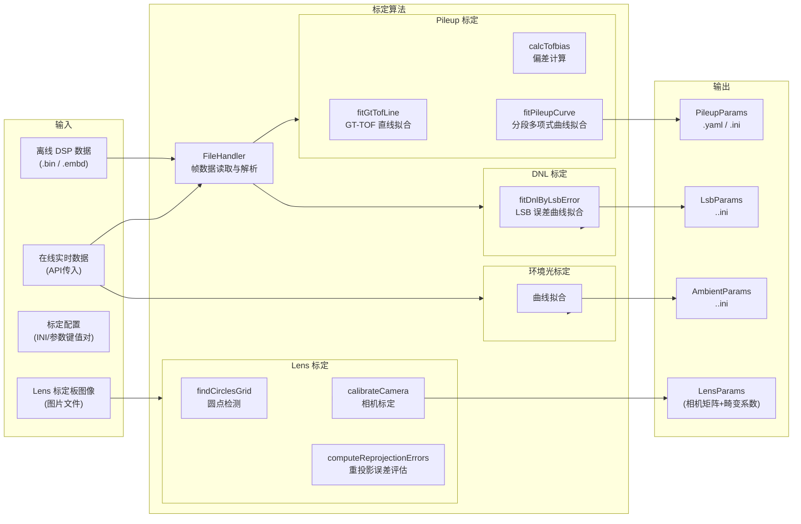
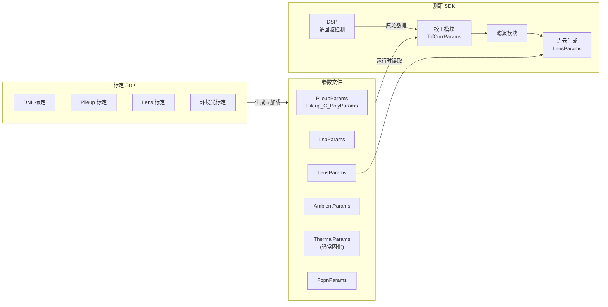

# 芯视界 3D 算法 SDK 分析文档

> **作者：** 芯小侠 🦊  
> **时间：** 2026-06-16  
> **版本：** v1.0  

---

## 目录

1. [项目总览](#1-项目总览)
2. [测距 SDK（VisionICS_3D_Algorithm）](#2-测距-sdkvisionics_3d_algorithm)
   - 2.1 [目录结构](#21-目录结构)
   - 2.2 [核心模块分解](#22-核心模块分解)
   - 2.3 [数据流](#23-数据流)
   - 2.4 [依赖及编译](#24-依赖及编译)
3. [标定 SDK（visionics_3d_calib_algorithm）](#3-标定-sdkvisionics_3d_calib_algorithm)
   - 3.1 [目录结构](#31-目录结构)
   - 3.2 [核心模块分解](#32-核心模块分解)
   - 3.3 [标定类型与流程](#33-标定类型与流程)
   - 3.4 [数据流](#34-数据流)
   - 3.5 [依赖及编译](#35-依赖及编译)
4. [两个项目的关系](#4-两个项目的关系)
5. [关键参数体系](#5-关键参数体系)
6. [已支持的传感器平台](#6-已支持的传感器平台)

---

## 1. 项目总览

芯视界 3D 算法体系包含 **两个相互独立的 SDK 项目**，分别承担不同的职责：

| 项目 | 路径 | 职责 |
|------|------|------|
| **测距 SDK** | `VisionICS_3D_Algorithm` | 实时测距流水线：原始数据 → DSP → 校正 → 滤波 → 点云 |
| **标定 SDK** | `visionics_3d_calib_algorithm` | 离线或在线标定算法：生成测距 SDK 所需的校正参数文件 |

两者通过 **参数文件**（INI / YAML） 和 **数据结构**（visionICs_3d_types.h / visionICs_3d_calib_types.h）衔接。标定 SDK 生成的标定结果加载到测距 SDK 的 `TofCorrParams` 中，完成"标定→测距"闭环。

---

## 2. 测距 SDK（VisionICS_3D_Algorithm）

> **Wiki：** http://wiki.evisionics.com/pages/viewpage.action?pageId=77004957  
> **主入口：** `VisionICs_3D_Algorithm.cpp`  
> **构建系统：** CMake（预设：CMakePresets.json）

### 2.1 目录结构

```
VisionICS_3D_Algorithm/
├── CMakeLists.txt          # 构建配置
├── CMakePresets.json       # CMake 预设
├── VisionICs_3D_Algorithm.cpp  # SDK 入口文件
├── release.py              # 发布打包脚本
├── config/                 # 传感器配置与标定参数文件
│   └── Anna/               # Anna 传感器配置
├── demo/                   # 示例程序
│   ├── main.cpp            # 主 Demo（测距全流程）
│   ├── demo_dsp.cpp        # DSP 模块 Demo
│   ├── demo_fileOps.cpp    # 文件操作 Demo
│   ├── liszt_test_code.cpp # Liszt 传感器测试
│   ├── main_haydn_clean.cpp # Haydn (Echo Mode) Demo
│   └── test_pcl.cpp        # 点云模块测试
├── library/
│   ├── include/            # 公共头文件
│   └── src/                # 实现源码
├── build/                  # 构建输出
└── out/                    # 运行输出
```

### 2.2 核心模块分解

SDK 以 **Controller 模式** 组织，采用面向接口设计，每个 Controller 提供独立的算法流水线阶段。

#### 模块依赖关系图

```
Raw Data
   │
   ▼
┌──────────────┐
│ FileOpsCtrl  │  ← 数据加载（Raw8/Raw10 文件或 buffer）
└──────┬───────┘
       │ HistogramData
       ▼
┌──────────────┐
│  DspCtrl     │  ← 核心 DSP 流水线
└──────┬───────┘
       │ DspOriginData
       ▼
┌──────────────┐
│ CorrCtrl     │  ← TOF 校正（多回波数据链构建 + 多维度校正）
│              │     负责多回波格式化 + 校正主函数
└──────┬───────┘
       │ FrameSocData
       ▼
┌──────────────┐
│ FilterCtrl   │  ← 滤波后处理
└──────┬───────┘
       │ FrameSocData
       ▼
┌──────────────┐
│  AppCtrl     │  ← 应用层后处理（高光抑制、近距均值深度）
└──────┬───────┘
       ▼
┌──────────────┐
│  PclCtrl     │  ← 点云生成（Lens 校正 + 坐标变换）
└──────────────┘
       │ PointCloud
       ▼
    SocData 输出
```

---

#### ① FileOpsController（文件操作模块）

**头文件：** `library/include/visionICs_3d_fileOps.h`  
**实现：** `library/src/visionICs_3d_fileOps.cpp`

负责从文件或内存 buffer 加载原始传感器数据，转换为 SDK 内部的直方图数据结构。

**核心接口：**

| 接口 | 说明 |
|------|------|
| `loadRaw8()` | 加载 Raw8 格式原始数据 |
| `loadRaw10()` | 加载 Raw10 格式原始数据（文件或 buffer） |

**辅助工具：**
- `split()` — 字符串分割
- `existsFile()` / `existDir()` — 文件/目录存在性检查
- `getAllFiles()` — 递归遍历目录
- `loadParamsFromIni()` — 从 INI 配置文件加载传感器参数与标定参数

---

#### ② DspController（DSP 处理模块）

**头文件：** `library/include/visionICs_3d_dsp.h`  
**实现：** `library/src/visionICs_3d_dsp.cpp`

SDK 最核心的模块，负责直方图信号处理，包括：Binning、非线性展开、MA 平滑、寻峰、多目标（多回波）检测。

**核心接口：**

| 接口 | 说明 |
|------|------|
| `dspMain()` | DSP 主流水线（标准模式） |
| `dspMain_16bit()` | 16bit 加速版本 DSP 流水线 |
| `dspMain_echoMode()` | Echo Mode 专用流水线（Haydn） |
| `version()` | 返回 SDK 版本号 |

**内部流水线（protected 方法）：**

| 步骤 | 接口 | 说明 |
|------|------|------|
| 1 | `binningHis()` | 直方图 Binning（步长合并），减少数据维度 |
| 2 | `binningHis3x3()` | 3×3 空间 Binning |
| 3 | `binningHis4x2()` | 4×2 空间 Binning |
| 4 | `binningHisOpencl()` | OpenCL 加速的 Binning 版本 |
| 5 | `normHis()` | 直方图非线性展开（可选） |
| 6 | `dspMultiObjFroPix()` | **单像素多目标 DSP 核心**：MA 平滑 → 寻峰 → 多回波检测 → 计算 FWHM、最大上升斜率等 |
| 7 | `dspMultiObjForPixForEchoMode()` | Echo Mode 单像素多目标处理 |

**寻峰流程（单像素）：**
1. 对直方图做 **移动平均（MA）** 平滑
2. 设定动态阈值（基于 TotalCount / NT）
3. 从前往后扫描，寻找超过阈值的峰值
4. 对每个候选峰计算：
   - **解距（TOF）**：三点法或质心法亚像素插值
   - **原始峰值（RawPeak）**
   - **噪声（Noise）**
   - **NT 计数（NT）**
   - **半高宽（FWHM）**
   - **最大上升斜率（MaxRisingSlope）**
5. 按 RawPeak 从大到小排序，保留前 N 个回波（Dsp_MultiObjNum）

**支持的传感器类型（SensorType）：**
- `ANNA` — 96×240 像素，256 bin，非鱼眼
- `LISZT` — 30×40 像素，64 bin
- `BACH` — 具体参数运行时配置

**解距模式（TofMode）：**
- `THREE_POINT` — 三点法插值解距
- `MASS_CENTER` — 质心法解距

**SIMD 优化：**
- 通过 `SIMD_DSP` 宏控制
- Windows 使用 AVX (`immintrin.h`)，Linux/AArch64 使用 NEON (`arm_neon.h`)
- 实现在 `utils.h` / `utils.cpp` 中

---

#### ③ CorrController（TOF 校正模块）

**头文件：** `library/include/visionICs_3d_corr.h`  
**实现：** `library/src/visionICs_3d_corr.cpp`

负责将 DSP 原始处理结果转换为结构化的多回波数据（多目标链表），并对 TOF 值进行多维度校正。

**核心接口：**

| 接口 | 说明 |
|------|------|
| `dspToSocData()` | DSP 原始数据 → 链表形式的多回波 SocData（含并行加速） |
| `corrMain()` | 校正主函数（含并行加速） |
| `extractSmallCorrParamsFromBinningStep()` | Binning Step 跨越时的参数转换 |

**dspToSocData 处理：**
- 将 `DspOriginData` 中每个像素的 N 个回波数据（RawTof、RawPeak、NT、FWHM、MaxRisingSlope）转换为 `ObjectItem` 链表
- 每个 `ObjectItem` 包含：`RawTof_lsb_S`、`tof_mm_N`、`RawPeak_count_N`、`Peak_count_N`（去噪后）、`NT_count_N`、`Fwhm`、`MaxRisingSlop`、反射率等

**corrMain 校正链：**

校正参数封装在 `TofCorrParams` 结构体中，各校正步骤按序执行：

| 校正项 | 参数结构 | 说明 |
|--------|----------|------|
| **像素噪声校偏** | — | 减去噪声（Noise）得到去噪峰值 |
| **峰值最大值过滤** | — | 剔除异常高值噪声峰 |
| **FPPN 校正** | `FppnParams` | 固定图形噪声（Fixed Pattern Pixel Noise） |
| **温漂校正** | `ThermalParams` | 基于 Tx/Rx 温度的 TOF 补偿（线性/二次模型 + 初始温漂） |
| **Pileup 校正** | `PileupParams` | 堆积效应（Pileup）导致的 TOF 偏移补偿，基于 Peakvalue/FWHM 查多项式曲线 |
| **DNL 校正** | `LsbParams` | 差分非线性（DNL）导致的周期性 LSB 误差补偿 |
| **环境光校正** | `AmbientParams` | 环境光引起的 Peakvalue 衰减 & TOF 偏移补偿 |
| **反射率计算** | `RefParams` | 基于 Peakvalue / NT 估算目标反射率，用于回波质量筛选 |
| **TOF LSB→mm** | — | LSB 到毫米单位转换 |

**Pileup 补偿原理：**
```
pileup_offset = pileup_curve(peakvalue [, fwhm])
tof_corrected = tof_raw - pileup_offset
```
- 每个像素 / 像素分组有独立的多项式拟合曲线
- 分段曲线：不同 Peakvalue 区间使用不同阶数的多项式
- 可选的 FWHM 作为补偿因子（`use_fwhm_for_pileup_fit`）

**DNL 补偿原理：**
```
dnl_offset = lsb_curve(tof_lsb % lsb_cycle)
tof_corrected = tof_raw - dnl_offset
```
- 补偿类型：无补偿、线性补偿、查表补偿
- 像素模式：全像素统一、分组、逐像素

---

#### ④ FilterController（滤波模块）

**头文件：** `library/include/visionICs_3d_filter.h`  
**实现：** `library/src/visionICs_3d_filter.cpp`

对校正后的多回波数据进行后处理滤波，提升点云质量和可用性。

**核心接口：**

| 接口 | 说明 |
|------|------|
| `filterMain()` | 滤波主函数 |
| `filterSimlarPeakOrigin()` | 相似峰值滤除（同一像素的多个回波） |
| `filterHighRefV2()` / `filterHighRefV3()` | 高反射物体导致的信号膨胀抑制 |
| `filterTrailingPoint()` | 拖点（飞点）滤除 |
| `genRoiMask()` | 生成四角滤除 ROI 掩码 |

**滤波链（filterMain）：**
1. **相似 Peak 滤除** — 同一像素内 TOF 和 Peakvalue 接近的多余回波
2. **强峰后回波过滤** — 极高反射率物体的后回波剔除
3. **拖点滤除** — 空间邻域不连续的孤立点（时间域的后发噪声）
4. **高反射膨胀抑制** — 高反物体（如金属）在点云中造成的放射状膨胀干扰
5. **孤立点滤除** — 空间邻域相关性评分，移除孤立异常点
6. **单回波最终孤立点滤除** — 对唯一回波进行精细的邻域一致性检查
7. **选择最终回波** — 根据设定模式（最前峰/最后峰/最强峰）选最终输出

**高反膨胀抑制（V3 优化版）：**
- 只对需要滤除的像素做 pattern 卷积计算，减少整体计算量
- 使用空间 Tof-Peak 柱状图加速膨胀判断

---

#### ⑤ PclController（点云生成模块）

**头文件：** `library/include/visionICs_3d_pcl.h`  
**实现：** `library/src/visionICs_3d_pcl.cpp`

负责 Lens 畸变校正与点云坐标变换。

**核心接口：**

| 接口 | 说明 |
|------|------|
| `correction_lens_run()` | 计算 Lens 单位向量缓存 |
| `correction_coordinate_transform_run()` | 深度图 → 3D 点云坐标变换 |
| `genDistortPoints()` | 生成畸变坐标映射 |
| `loadLensDirsMatlabByFile()` | 从文件加载 Lens 方向向量 |

**工作原理：**
1. 基于 Lens 内参矩阵 + 畸变系数，生成每个像素的 **3D 空间方向向量**（单位向量）
2. 将深度值（TOF 校正后）沿方向向量展开，得到 `(x, y, z)` 点云坐标
3. 支持鱼眼模型（Anna）和针孔模型（Liszt）两种畸变模型

---

#### ⑥ ApplicationController（应用层模块）

**头文件：** `library/include/visionICs_3d_Application.h`  
**实现：** `library/src/visionICs_3d_Application.cpp`

面向最终应用场景的高级处理。

| 接口 | 说明 |
|------|------|
| `applicationMain()` | 应用层主函数（预留） |
| `filterHighlight2()` | 高光抑制：检测并修复过曝区域 |
| `meanDepthAtNear()` | 近距均值深度：对近距区域做平滑 |

---

#### ⑦ OpenclController（OpenCL 加速模块）

**头文件：** `library/include/visionICs_3d_opencl.h`

为 Binning 等计算密集型操作提供 OpenCL 加速。
- 启用条件：编译时定义 `USE_OPENCL` 宏
- Singleton 模式

---

#### ⑧ 辅助模块

| 文件 | 说明 |
|------|------|
| `select_A_or_B.h/cpp` | A/B 帧识别：通过四个参考像素的直方图统计判断当前数据属于 A 帧还是 B 帧（Anna 双帧读出模式） |
| `utils.h/cpp` | 通用工具函数：Raw10→直方图转换、Binning（支持 Echo Mode）、卷积（NEON SIMD）、寻峰（NEON）、数据类型转换等 |

---

### 2.3 数据流

```mermaid
flowchart LR
    subgraph Input[输入]
        Raw["Raw Data<br/>(Raw8 / Raw10)"]
        Config["Config<br/>(INI)"]
    end

    subgraph DSP[DSP 流水线]
        Load["FileOpsCtrl<br/>加载直方图"]
        Bin["Binning<br/>(步长+空间)"]
        Norm["非线性展开"]
        MA_Smooth["MA 平滑"]
        Peak_Find["寻峰<br/>(Threshold→Peak)"]
        Multi_Echo["多目标检测<br/>(Top-N回波)"]
    end

    subgraph Corr[校正模块]
        Convert["dspToSocData<br/>原始数据→多回波链表"]
        FPPN["FPPN 校正"]
        Thermal["温漂校正"]
        Pileup["Pileup 校正"]
        DNL["DNL 校正"]
        Ambient["环境光校正"]
        Ref["反射率计算"]
    end

    subgraph Filter[滤波模块]
        SimPeak["相似峰滤除"]
        StrongPeak["强峰后回波过滤"]
        Trail["拖点滤除"]
        HighRef["高反膨胀抑制"]
        Scatter["孤立点滤除"]
        SelectObj["选择最终回波"]
    end

    subgraph Output[输出]
        Apply["应用层<br/>(高光/近距平滑)"]
        Pcl["点云生成<br/>(Lens+坐标变换)"]
        SocData["FrameSocData"]
    end

    Raw --> Load
    Config --> Load
    Load --> Bin --> Norm --> MA_Smooth --> Peak_Find --> Multi_Echo
    Multi_Echo --> Convert --> FPPN --> Thermal --> Pileup --> DNL --> Ambient --> Ref
    Ref --> SimPeak --> StrongPeak --> Trail --> HighRef --> Scatter --> SelectObj
    SelectObj --> Apply --> Pcl --> SocData
```



---

### 2.4 依赖及编译

**依赖库：**
- OpenCV（核心依赖，用于图像处理、矩阵运算）
- OpenCL（可选，用于 Binning 加速）
- pthread / OpenMP（并行加速）

**编译方式：**
```bash
# 使用 CMakePresets.json
cmake --preset=windows-release  # Windows
cmake --preset=linux-release    # Linux

# 或直接 CMake
mkdir build && cd build
cmake .. -DCMAKE_BUILD_TYPE=Release
cmake --build .
```

**编译宏控制：**
| 宏 | 作用 |
|----|------|
| `SIMD_DSP` | 启用 SIMD 加速（NEON/AVX） |
| `USE_OPENCL` | 启用 OpenCL 加速 |
| `IS_WIN` | Windows 平台适配 |

---

## 3. 标定 SDK（visionics_3d_calib_algorithm）

> **Wiki：** http://wiki.evisionics.com/pages/viewpage.action?pageId=106235512  
> **主入口：** 各 Demo 文件  
> **构建系统：** CMake

### 3.1 目录结构

```
visionics_3d_calib_algorithm/
├── CMakeLists.txt           # 构建配置
├── README.md                # 项目说明（含 Wiki 链接、编译说明）
├── lens_calib_test.py       # Lens 标定参考 Python 脚本
├── lens说明.md               # Lens 标定原理文档
├── config/                  # 标定配置
│   └── bach/                # Bach 传感器标定配置
├── demo/                    # Demo 程序
│   ├── main.cpp             # 主 Demo（标定全流程交互菜单）
│   ├── main_pileup.cpp      # Pileup 标定 Demo
│   ├── test_dnl_pileup.cpp/h # DNL + Pileup 联合标定测试
│   ├── test_light.cpp/h     # 环境光标定测试
│   ├── test_pileup.cpp/h    # Pileup 标定测试
│   ├── main-Lens-Liszt.cpp  # Liszt Lens 标定
│   └── main-pileup-bach-backup-260203.cpp  # 备份
├── library/
│   ├── include/             # 公共头文件
│   └── src/                 # 实现源码
├── VisionICS_3D_Algorithm/  # 引用测距 SDK 的头文件
├── resources/               # 文档图片资源
├── build/                   # 构建输出
└── out/                     # 运行输出
```

### 3.2 核心模块分解

标定 SDK 采用 **基类+派生类** 的架构，通过统一的抽象基类 `CalibBaseClass` 约束接口。

#### 统一基类：CalibBaseClass

**头文件：** `library/include/visionICs_3d_calib_base.h`

```cpp
class CalibBaseClass {
    virtual RetCode runPrepare() = 0;            // 准备数据
    virtual RetCode runCalib() = 0;              // 执行标定
    virtual RetCode setInputDatas(params) = 0;   // 设置输入数据
    virtual RetCode setParams(params) = 0;       // 设置标定参数
    virtual RetCode parseInputDatas() = 0;       // 解析输入数据
    virtual RetCode drawCalibResultImages() = 0;  // 绘制结果图
    virtual RetCode saveCalibResultDatas(dir) = 0;// 保存结果
    virtual getInputDatasKeys()                  // 获取输入数据键列表
    virtual getParamsKeys()                      // 获取参数键列表
    virtual getOutputKeys()                      // 获取输出键列表
    virtual getResultImages()                    // 获取结果图像
};
```

---

#### ① FileHandler（数据文件处理）

**头文件：** `library/include/visionICs_3d_file.h`  
**实现：** `library/src/visionICs_3d_file.cpp`

负责读取标定所需的数据文件（测距 SDK 输出的离线 DSP 文件或在线实时数据）。

**核心接口：**

| 接口 | 说明 |
|------|------|
| `readFrameFromFile()` | 从单个文件读取帧数据 |
| `readEmbdFromFile()` | 读取嵌入式（Embd）格式的单帧 |
| `readEmbdFromDir()` | 从目录读取多帧 Embd 数据 |
| `readStepsEmbdFromDir()` | 读取多距离步进的 Embd 数据 |
| `readFramesFromDir()` | 从目录批量读取帧数据（支持中间帧过滤） |
| `readStepsFramesFromDir()` | 读取多距离步进的帧数据（关键接口） |

**标定数据来源：**
- **离线模式**：测距 SDK 预先处理并保存的 `.bin` / `.embd` 帧文件
- **在线模式**：通过 API 直接传入实时帧数据

**数据格式：**
- 使用 Cereal 库（C++ 序列化）进行二进制序列化
- 每帧包含：`ObjItem[]`（所有像素的多回波数据）、帧索引、Tx/Rx 温度

---

#### ② PileupCalib（Pileup 标定）

**头文件：** `library/include/visionICs_3d_calib_pileup.h`  
**实现：**
- `visionICs_3d_calib_pileup.cpp`（基类通用实现）
- `visionICs_3d_calib_pileup_anna.cpp`（Anna 专用实现）
- `visionICs_3d_calib_pileup_bach.cpp`（Bach 专用实现）
- `visionICs_3d_calib_pileup_liszt.cpp`（Liszt 专用实现）

**目的：** 标定 Pileup（堆积效应）导致的 TOF 偏移量与 Peakvalue / FWHM 之间的映射关系。

**标定原理：**

Pileup 效应发生在 SPAD（单光子雪崩二极管）传感器中：当目标距离较近（信号强度大）时，光子到达率过高导致 SPAD 死区时间内"堆积"事件被漏计数，使得直方图峰值发生偏移，导致测距偏差。

```
Pileup 现象：近距离时 TOF 偏大（测远），Peakvalue 越大偏越远
```

**核心算法：**

| 步骤 | 函数 | 说明 |
|------|------|------|
| 1 | `fitGtTofLine()` | 用弱信号（无 Pileup 效应）数据拟合 GT-TOF 直线（k, b），作为真实距离参考 |
| 2 | `calcTofbias()` | 计算各距离/Peakvalue 下的 TOF 偏差（tof_diff = measured - gt） |
| 3 | `fitPileupCurve()` | 对 (Peakvalue, tof_diff) 数据集做分段多项式拟合，得到 Pileup 补偿曲线 |

**输入数据要求：**
- 多个距离步进（如 0.2m、0.5m、1m、2m…）
- 每个距离使用不同衰减片的多种信号强度数据
- 每个像素有足够的采样点用于拟合

**拟合策略：**
```
GT-TOF 直线: tof_gt(k, b) = gt_k * distance + gt_b
            └── 仅使用 Peakvalue < min_th 的数据（无 Pileup 效应区域）

Pileup 曲线: tof_bias = poly_eval(peakvalue)
            └── 分段拟合：[min_th, mid_th] + [mid_th, max_th]
                每段不同阶数多项式（curve_poly_n）
```

**异常处理：**
- `pixes_enable_fit`：ROI 设置，每个像素独立开关
- `pixes_error`：拟合误差超标（> `min_error`）的像素视为异常
- `golden_pix`：异常像素用 golden 像素的曲线替代

**芯片专用实现：**

| 类 | 说明 |
|----|------|
| `PileupCalib` | 基类，提供通用的 `fitGtTofLine`、`fitPileupCurve`、`calcTofbias` 静态方法 |
| Anna | Anna 传感器实现（含 `runPrepare`、`runCalib` 等完整接口） |
| Bach | Bach 传感器实现：支持离线/在线两种模式，含 `saveCalibResultToYaml` |
| Liszt | Liszt 传感器实现 |

**Bach Online 标定流程：**
```
1. prepareOnline():
   ├── 初始化内参、ROI
   └── 配置标定参数（Pileup 曲线阶数、GT-TOF 阈值等）

2. runOnline():
   ├── 获取当前帧数据（来自自动化设备）
   ├── 提取每个像素的 Peakvalue、TOF 数据
   ├── 分批累积多距离数据
   └── 数据充足 → 执行曲线拟合

3. 获取结果：
   └── PileupCalib.curve_coeffs → Pileup 多项式系数
```

---

#### ③ DnlCalib（DNL 标定）

**头文件：** `library/include/visionICs_3d_calib_dnl.h`  
**实现：** `visionICs_3d_calib_dnl.cpp`

**目的：** 标定 DNL（差分非线性）导致的周期性 TOF 误差。

**DNL 误差特征：**
- 由 TDC（时间数字转换器）LSB 宽度不均匀引起
- 表现为以 LSB 为周期的锯齿状 TOF 误差
- 通常每个 LSB 周期的误差模式相似

**核心算法：**

| 步骤 | 函数 | 说明 |
|------|------|------|
| 1 | 数据准备 | 采集不同距离的 TOF 残差（与真值的偏差） |
| 2 | `fitDnlByLsbError()` | 基于 TOF 残差拟合 DNL 补偿曲线 |
| 3 | `fitDnlByLsbErrorByBars()` | 柱状图模式：按 LSB 分位取均值 |
| 4 | `fitDnlByLsbErrorByCurves()` | 曲线模式：更平滑的拟合方式 |

**DNL 补偿模式：**

| 模式 | 说明 |
|------|------|
| `ONE_TO_ALL` | 所有像素共用一套 DNL 曲线 |
| `ONE_TO_GROUP` | 像素分组，每组一套曲线 |
| `ONE_TO_ONE` | 逐像素独立曲线（最精确） |

**DNL 参数结构（LsbParams）：**
```
corr_type: 补偿方式（0=无 / 1=线性 / 2=查表）
lsb_bin_gap: 查表间隔（lsb）
lsb_cycle: 周期（lsb）
lsb_base: 基准距离（mm）
lsb_offset_mm[]: 偏移表
```

---

#### ④ LensCalib（Lens 标定）

**头文件：** `library/include/visionICs_3d_calib_lens.h`  
**实现：** 
- `visionICs_3d_calib_lens.cpp`（基类通用实现）
- `visionICs_3d_calib_lens_liszt.cpp`（Liszt 专用实现）

**目的：** 标定镜头内参（焦距、主点）和畸变系数（径向+切向）。

**原理：** 基于**张正友标定法**，使用对称圆点网格标定板。

**详细原理文档：** `lens说明.md`（共 530+ 行，涵盖校准流程、公式推导、代码详解）

**标定流程：**
```
1. runPrepare():
   ├── 读取标定板图像（多角度多张）
   ├── 创建 3D 对象点（标定板坐标系）
   ├── 检测圆点（findCirclesGrid + SimpleBlobDetector）
   └── 建立 3D-2D 对应关系

2. runCalib():
   ├── 构造初始内参矩阵（fx, fy, cx, cy）
   ├── 执行 cv::calibrateCamera()（Levenberg-Marquardt）
   ├── 计算重投影误差
   └── 转换内参到原始图像尺寸

3. 结果输出：
   ├── Camera Matrix（3×3）
   ├── Distortion Coeffs（k1, k2, p1, p2, k3）
   └── 重投影误差（RMS, per-view）
```

**标定板规格：**
- 5 列 × 4 行 = 20 个圆点
- 对称圆点网格

**支持的传感器（畸变模型）：**
| 传感器 | 畸变模型 |
|--------|----------|
| Anna | 鱼眼模型（`Lens_C_Xyz_UseFishEye = true`） |
| Liszt | 针孔模型（`Lens_C_Xyz_UseFishEye = false`） |

**Liszt Lens 标定特点：**
- 低分辨率（30×40 像素），LR 低分辨率模式
- 图像缩放（默认 2×）提升检测精度
- 初始焦距可从标称值或手动输入获取

---

#### ⑤ LightCalib（环境光标定）

**头文件：** `library/include/visionICs_3d_calib_light.h`  
**实现：** `visionICs_3d_calib_light.cpp`

**目的：** 标定环境光（Ambient Light）对 Peakvalue 和 TOF 的干扰模型。

**环境光效应：**
- **Peakvalue 衰减**：环境光增加 SPAD 死区概率，导致信号 Peakvalue 下降
- **TOF 偏移**：环境光引入额外的光子噪声，导致峰值检测位置发生偏移

**标定输出：**

| 模型 | 结构 | 说明 |
|------|------|------|
| `LightPeakvalueModel` | `{nt_k, threshold, coeffs_low, coeffs_high}` | Peakvalue 衰减补偿（分段） |
| `LightTofOffsetModel` | `{ma[], ma_sum, coeffs[]}` | TOF 偏移补偿（多项式+MA窗） |
| `LightCalibResult` | `{gt_tof_k, gt_tof_b, peakvalue_model, tof_offset_model, ...}` | 完整标定结果 |

**数据组织（LightStepStats）：**
```
每个距离步进包含：像素索引、TOF、Peakvalue、Noise、NT、Tx/Rx 温度、FWHM、上升斜率
```

---

#### ⑥ FppnCalib（FPPN 标定）

**头文件：** `library/include/visionICs_3d_calib_fppn.h`

**状态：** 空骨架，待实现。

FPPN（Fixed Pattern Pixel Noise，固定图形像素噪声）是每个像素固有的 TOF 偏移模式。

---

### 3.3 标定类型与流程

| 标定类型 | 基类 | 芯片实现 | 主要方法 | 输出参数 |
|----------|------|----------|----------|----------|
| **Pileup 标定** | `PileupCalib` | Anna、Bach、Liszt | `fitGtTofLine` → `calcTofbias` → `fitPileupCurve` | `PileupParams` |
| **DNL 标定** | `DnlCalib` | Anna、Bach | `fitDnlByLsbError`（曲线/柱状图） | `LsbParams` |
| **Lens 标定** | `LensCalib` | Anna、Liszt | `findCirclesGrid` → `calibrateCamera` | `LensParams` |
| **环境光标定** | — | Bach | `fitGtTofLine` → 曲线拟合 | `LightCalibResult` |
| **FPPN 标定** | — | — | 未实现 | `FppnParams` |

### 3.4 数据流



---

### 3.5 依赖及编译

**依赖库：**
- OpenCV（核心依赖：`calibrateCamera`、矩阵运算、图像读写）
- Cereal（C++ 序列化：帧数据读写）
- SciPlott + gnuplot（可选，调试绘图用）

**编译方式：**
```bash
mkdir build && cd build
cmake .. -DCMAKE_BUILD_TYPE=Release
cmake --build .
```

**可选宏控制：**
| 宏 | 作用 |
|----|------|
| `IS_DRAW_DEBUG_INFO` | 启用调试绘图（依赖 SciPlott + gnuplot，设为 0 可去掉此依赖） |

---

## 4. 两个项目的关系



**关键衔接点：**

| 衔接 | 标定 SDK 输出 | 测距 SDK 消费 |
|------|---------------|---------------|
| Pileup 参数 | `PileupParams::Pileup_C_PolyParams` | `CorrController::corrMain()` → Pileup 校正 |
| DNL 参数 | `LsbParams::lsb_offset_mm` | `CorrController::corrMain()` → DNL 校正 |
| Lens 参数 | `LensParams`（相机矩阵、畸变系数） | `PclController` → 点云坐标变换 |
| 环境光参数 | `AmbientParams` | `CorrController::corrMain()` → 环境光校正 |

---

## 5. 关键参数体系

测距 SDK 的参数通过 `TofCorrParams` 统一封装，由多个子参数结构体组成：

```
TofCorrParams
├── LensParams           // 镜头内参 + 畸变系数
│   ├── CameraMatrix     // 内参矩阵 [fx, fy, cx, cy]
│   ├── DistCoeffs       // [k1, k2, p1, p2, k3, k4, k5, k6, p1, p2, s]
│   └── UseFishEye       // 鱼眼/针孔模型切换
│
├── FppnParams           // 固定像素噪声补偿
│   ├── FPPN_mm_N[]      // 逐像素 TOF 补偿值
│   └── FPPN_Global_mm_N // 全局补偿值
│
├── ThermalParams        // 温漂补偿
│   ├── Thermal_C_Tof_1_A          // 线性系数
│   ├── Thermal_C_Tof_2_A/_B      // 二次系数
│   ├── Thermal_C_Tof_InitTxTemperature // 初始温度
│   ├── Thermal_C_Tof_TsBringUpCorr // 初始段温漂
│   └── UseBringUpCorr / IsThermalCorrLinear / UseThermalCorr
│
├── PileupParams         // 堆积效应补偿
│   ├── Pileup_C_PolyThresholdList // 分段阈值
│   ├── Pileup_C_PolyNList         // 各段阶数
│   ├── Pileup_C_PolyParams        // 多项式系数（每个像素 N 组）
│   ├── Pileup_C_PeakvalueScale    // Peakvalue 缩放因子
│   ├── use_fwhm_for_pileup_fit    // FWHM 作为补偿因子
│   └── use_peakvalue_add_slope    // 斜率加权补偿
│
├── LsbParams            // DNL 补偿
│   ├── corr_type        // 0=无 1=线性 2=查表
│   ├── lsb_bin_gap      // 查表间隔
│   ├── lsb_cycle        // 周期
│   ├── lsb_base         // 基准
│   └── lsb_offset_mm[]  // 偏移表
│
├── RefParams            // 反射率参数
│   ├── Ref_C_RefScale_1_A         // 全局缩放
│   ├── Ref_C_RefScaleMap_1_A[]    // 逐像素缩放
│   └── Ref_C_RefTofOffset_0_A     // TOF 偏移
│
└── AmbientParams         // 环境光补偿
    ├── PeakvalueModel    // Peakvalue 补偿
    ├── TofOffsetModel    // TOF 偏移补偿
    └── CorrectionMode    // 模式选择
```

---

## 6. 已支持的传感器平台

| 传感器 | 代号 | 分辨率 | Bin 数 | 特性 |
|--------|------|--------|--------|------|
| Sensor A | **Anna** | 96×240 | 256 | 双帧读出（A/B），鱼眼畸变，参考像素帧识别 |
| Sensor B | **Liszt** | 30×40 | 64 | 低分辨率，针孔模型 |
| Sensor C | **Bach** | 运行时配置 | 运行时配置 | 支持 Echo Mode（Haydn），在线标定主要平台 |

---

## 附：Demo 程序说明

### 测距 SDK Demo（main.cpp）

交互式菜单，测试完整的测距流水线各阶段。

**关键测试功能：**
1. 全流水线测试（从 Raw 文件到多回波点云输出）
2. 多目标链表性能测试
3. 单帧调试（指定像素调试输出）
4. 配置文件加载与验证

### 标定 SDK Demo（main.cpp）

交互式菜单，覆盖主流标定场景：

| 选项 | 功能 | 说明 |
|------|------|------|
| 0 | Bach Pileup Prepare (offline) | 离线数据准备 |
| 1 | Bach Pileup Run (offline) | 离线执行标定 |
| 2 | Bach Pileup Show Results | 调试绘图 |
| 3-5 | Bach Pileup Online | 在线标定（自动化设备模式） |
| 6 | Save Pileup Results | 保存结果到 YAML |
| 7 | Pileup & DNL Combined Save | 联合标定保存 |
| 8 | DNL Draw Results | DNL 结果绘图 |
| 9 | Ambient Light Calib | 环境光标定 |
| 10 | Ambient Light Draw | 环境光标定绘图 |
| 11 | Exit | 退出 |

---

*文档结束 · 芯小侠 🦊*
